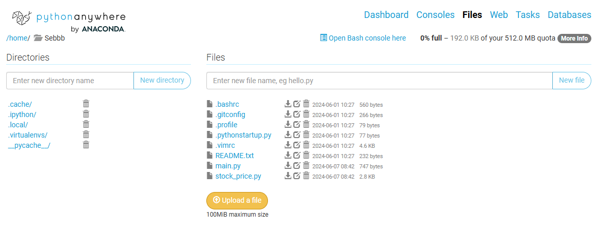

# Python

## Project_1
### Python Project_1 Stock Price API & Pythonanywhere & E-mail Notification

The aim of this project is to receive 3 stock prices for the last 3 days aumtomatically by using Python/ PythonAnywhere/ Email. 


#### Step 1
To extract information from free stock price API from ```https://www.alphavantage.co/query```

[main.py](https://github.com/sebsebsebsebtimes4/Python/blob/main/main.py)

[stock_price.py](https://github.com/sebsebsebsebtimes4/Python/blob/main/stock_price.py)



